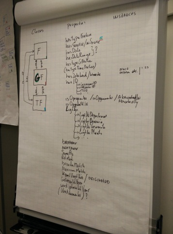
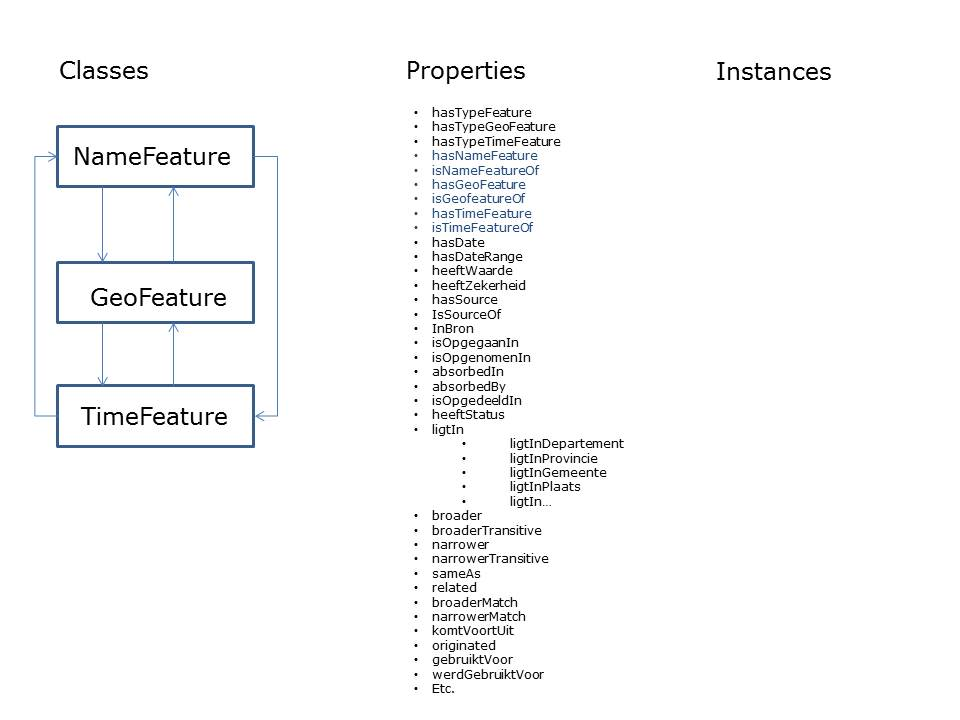

# Ontologie

Afgelopen 2 dagen ben ik o.a. bezig geweest met het bedenken hoe een ontologie voor de geocoder uit zou kunnen zien.

Ik heb dit gedaan met mijn collega Patrick Mout en, via email, met Petra.

Er worden 3 classes vastgesteld: die classes krijgen data en/of objectproperties en hebben instances/individuals.

- `NameFeature`: met properties als `prefLabel`, `bron`, `type` (straat|gemeente|departement), `dates` (van voorkomen in de bron)
- `Geofeature`: met properties als `bron`, `type` (point|polygon), `geometry`, `dates` (van bestaand hebben in de ruimte)
- `Timefeature`: met properties als `bron, `type` (eeuw, periode, etc.), `date`, etc.

Waarbij symetrische relaties tussen gelegd kunnen worden tussen de features, onderling.

NB. Het gaat niet om de naamgeving, die staat wat mij betreft ter discussie, net als de lijst van properties.

Nog op te lossen:

-	Is dit goed zo?
-	Naamgeving properties?
-	Zijn het alle properties? Vgl. bestand Bert.
-	Opdelen data en objectproperties
-	Naamgeving Nederlands of Engels?
-	Het `A rdfs:subClassOf B .` en `x rdf:type A .` dan `x rdf:type B .` Principe: Omdat `ObjectA` in `ObjectB` ligt en `ObjectB` in `ProvincieY`, ligt `ObjectA` dus ook in `ProvincieY`. Volgens mij hoeft dat geen probleem te zijn omdat een van de 2 andere “features” het onderscheid zal maken.
