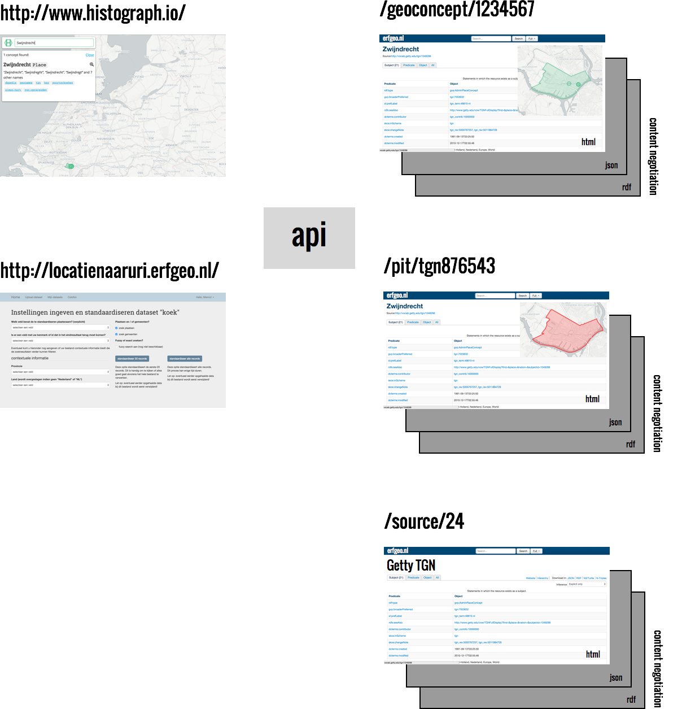

#URI strategie
De Historische Geocoder levert niet alleen gestandaardiseerde namen en geometrieën voor collectiebeheerders, maar ook URI's. Met deze URI's beschikt de collectiebeheerder op (als hij/zij hierin geïnteresseerd is) altijd over een web-bevraagbaar adres waar staat uitgelegd wat de gestandaardiseerde term inhoudt. Maar wat houdt zo'n URI eigenlijk in? Daarom: een aantal axioma's die duidelijk maken wat er wordt geleverd aan URI's die door de Historische Geocoder worden geleverd.

1. Een collectiehouder die de [webtool](http://locatienaaruri.erfgeo.nl) gebruikt, verrijkt zijn/haar data met één of meer gestandaardiseerde topografische aanduidingen (labels), één of meer geometrieën en één of meer URI's. Dit kunnen externe URI's zijn (zoals afkomstig van TGN of GeoNames) en/of een Histograph-URI.
2. Deze Histograph-URI representeert een Geoconcept. 
3. Een Geoconcept representeert een verzameling PiTs, aan elkaar gerelateerd met sameAs- en usedFor-relaties.
4. Een Geoconcept is geen PIT. Het heeft (of is gedefinieerd door) enkel relaties met PITs.
3. Een PIT is een Place In Time of een Plaats In de Tijd: een door E&L geaccepteerde bronvermelding van een plek op een bepaald moment of periode.
4. Iedere PIT heeft een eigen PIT-URI. Iedere PIT krijgt deze, ongeacht of deze al een externe URI heeft.
5. Een PIT is onderdeel van slechts één Geoconcept.
4. De Historische Geocoder biedt voor alle Geoconcepten een eigen Histograph-URI, dit is zodat de collectiehouder een uniforme dienst en blik krijgt op de elementen waarmee hij/zij de dataset heeft verrijkt en de PITs die dit Geoconcept omvat.
5. De Histograph-URI biedt toegang tot de verzameling topografische aanduidingen (PITs) die aan het concept verbonden zijn.
6. Iedere PIT is ook een 'poort' tot de knooppunten en verbindingen in een samenhangende set topografische aanduidingen.
6. De Histograph-URI's vormen zowel menselijk-leesbare (html) als machine-leesbare (minimaal JSON-LD) ingangen in topografische aanduidingen die de historische geocoder ontsluit.
7. Deze verschillende representaties zijn met '[content negotiation](http://en.wikipedia.org/wiki/Content_negotiation)' op te vragen. Een browser vraagt over het algemeen standaard een html-pagina op.
8. De Histograph-URI's moeten persistent worden gemaakt, door deze aan te melden bij een URI-dienst die op lange termijn bereikbaarheid en beschikbaarheid garandeert.
9. Elke Bron krijgt een eigen source URI, die de complete dataset op hoofdlijnen beschrijft.
10. Een histograph-query kan een deel van een verzameling plaatsen (voorheen 'klont') tonen, maar een dergelijke query kan geen URI krijgen: de uitkomst is immers dynamisch, traploos (geografisch, temporeel)

Nederlandstalig? Concept en Plaats In Tijd zijn dat al, maar i.p.v. Source kunnen we Bron gebruiken.

