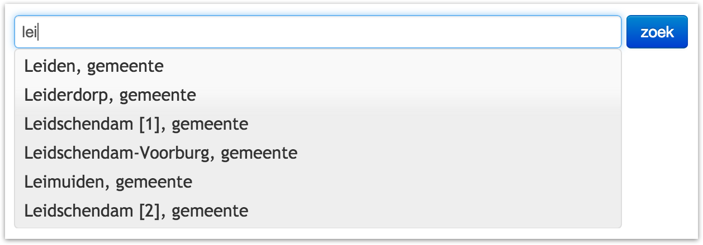

#Voorbeeld queries / Demo apps

##historische straatnamen in plaats x

App toont lijst met alle straten binnen een woonplaats en hun naamsvarianten. De lijst is - binnen de app - te filteren op (deel van) naam. Doel van de app is snel straatnaamvarianten te kunnen achterhalen of juist de huidige straatnaam op basis van een historische naamvariant te vinden. Archiefmedewerkers in Nijmegen en Leiden die een dataset maken zien zo ook wat ze hebben ingevoerd.

`q=*&liesIn=Nijmegen&type=hg:Street`
geeft alle straten in Nijmegen

    MATCH (p:hg_Province) WHERE p.name =~ "Zuid-Holland"
    WITH p AS province
    MATCH shortestPath( (province)<-[:hg_liesIn|:hg_sameHgConcept * 1 .. 16]-(n:hg_Street) )
    RETURN DISTINCT n LIMIT 10

`q=*&liesIn=tgn/12345678&type=hg:Street`
geeft alle straten in plaats met dit pitid (als plaatsnaam ambigu is)

`q=hezelstraat&liesIn=Nijmegen&type=hg:Street`
geeft Hezelstraat in Nijmegen

Het is voor deze app niet nodig geometrieën van de api terug te krijgen. Performance gaat waarschijnlijk omhoog als je zoiets als `&geojson=false` of `&geom=false` mee kan geven.

##historische dorpskaart

De app toont een kaart van een dorp (het zal De Rijp zijn) met alle (naar keuze) straten of gebouwen die in een bepaald jaar (instelbaar) bestonden.

Je zou de straten kunnen ophalen op basis van hierarchische relatie, maar ik kan me allerlei situaties voorstellen waarin je dat liever op basis van bounding box doet. Bijvoorbeeld als je hetzelfde met de Watergraafsmeer wilt doen.

`type=hg:Street&boundingbox=52.5614,4.8278,52.5464,4.8617&period=1900,1901`

##widget plaatskiezer met autocomplete

Typen in tekstveld geeft afrol met plaatsnamen die beginnen met getypte string. Bij ambigue plaatsen als Zwolle wordt ook bovenliggende entiteit (provincie, waarschijnlijk) in de hierarchie getoond, wat geen probleem is als liesIn relaties meekomen in api.

Per instance van de app kan aangegeven worden uit welke dataset resultaten teruggegeven moeten worden. Behalve naam wordt ook (pit)uri meegegeven.

App kan als widget ingebouwd worden in bijv. coll. management systeem om plaatsen gestandaardiseerd op te slaan.

`q=lei*&resultsFromSet=tgn&geojson=false`

Met oog op snelheid kan hier afgezien worden van geojson. Ranking is ook van belang - bovenstaande query zou eerst Leiden en dan pas Leiderdorp kunnen geven.

Plaatsnaamvarianten vinden zou ook mooi zijn, zodat `q=ley*&resultsFromSet=tgn&geojson=false` ook Leiden etc. oplevert.

Screendumpje hieronder komt van gemeentegeschiedenis. Het idee is net zoiets, maar dan ook voor plaatsen. Daarbij vult het ding in een tweede tekstveld een uri in.

##visualisatie gemeentes in jaar

Ik wil kaartje tonen met alle gemeentes in Utrecht in bepaald jaar. Of van heel Nederland. Dit is een vraag die we vanuit een door het IISG te ontwikkelen visualisatietool kunnen verwachten.

`type=hg:Municipality&period=1859,1860&liesIn=Nederland`

of

`type=hg:Municipality&hasBeginningBefore=1859&hasEndAfter=1859&liesIn=Nederland`

Behalve zoeken op tijd speelt hier de nu nog beperkte limiet een grote rol.

##alle verdwenen dorpen in Zeeland

Zoek plaatsen binnen boundingbox die voor 1900 verdwenen zijn. Of zoek alle verdwenen gebouwen in Amsterdam Oost.

Dit lukt niet met de voorgestelde `period=` hierboven, want we willen juist dingen die er na een bepaalde datum _niet_ meer zijn.

`type=hg:Place&boundingbox=52.56,4.82,52.54,4.17&hasEndBefore=1980`

##enkele dataset

- zoek alleen binnen bepaalde dataset

kan je meteen één hele dataset binnenhalen! Of alleen Amsterdam uit atlas van de verstedelijking

- zoek binnen alle datasets, maar geef alleen resultaten van één bepaalde dataset

Niene wil geen drie puntjes per plaats als ze op *zee zoekt! Zie ook widget plaatskiezer.

#Concluderend

- zoeken op periode
- zoeken op bounding box
- zoeken op typen
- zoeken op naam
- zoeken binnen dataset
- zoeken op combinaties daarvan
- results beperken tot één dataset
- results zonder geometrie geven, voor performance
